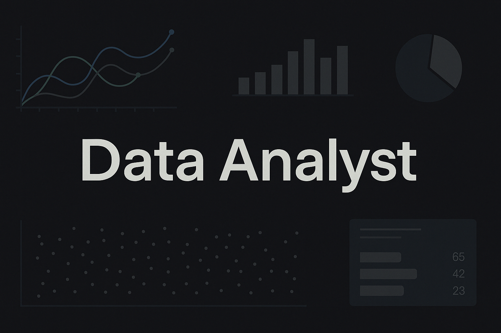

# Hi there, I'm Daniel 👋

## 👨‍💻 About Me

🎨 The Creative Strategist in the Data Lab
Daniel López is a rare hybrid: part data detective, part digital alchemist. By day, he wrangles Python scripts and DEI campaigns with precision and purpose. By night, he conjures AI art, layers shaders in p5.js, and turns emotional storms into creative fuel.

He’s a quiet force — introspective but unyielding, someone who’s weathered emotional avalanches yet still crafts stories, visuals, and experiences that speak louder than words. Whether it’s decoding user behavior or sketching cosmic typographic boards, Daniel’s quest is always the same: to find truth, beauty, and maybe a bit of poetic justice.

🔥 Passionate. 💡 Resourceful. 🧠 Analytical.
🖤 Healing. ✨ Evolving. 🎯 Still aiming for that personal masterpiece.

Want to connect? 👉 [LinkedIn](https://www.linkedin.com/in/daniel-l%C3%B3pez-monte%C3%B3n-861653123/)

---

## 🛠️ Skills and Tools

  
  
  
  
  
  
  
  
  
  
  
  
  

---

## 🚀 Featured Projects

- 📊 **Marketing Dashboard with Tableau**  
  Interactive dashboard built to visualize marketing KPIs and identify trends across campaigns.  
  [View project](https://github.com/yourusername/marketing-dashboard)

- 🧪 **A-A-B-Experiment-Analysis-Sales-Funnel-Exploration**  
  I work as a data analyst for a food product startup. My mission is to investigate user behavior within the mobile app, explore the sales funnel, and assess the impact of UI font changes through an A/A/B experiment.  
  [View project](https://github.com/DanyHook/A-A-B-Experiment-Analysis-Sales-Funnel-Exploration)

- 📈 **Data-Driven_Business_Decisions**  
  This project is the final assessment of the Data-Driven Business Decisions module at TripleTen. It simulates the role of a data analyst working with a large online store. Your task is to prioritize revenue-growth 
  hypotheses, run an A/B test, and analyze the results to support strategic decisions.  
  [View project](https://github.com/DanyHook/Data-Driven_Business_Decisions)

---

## 📜 Certifications

- 🎓 **Data Analyst Bootcamp - TripleTen**  
  Hands-on program covering Python, SQL, and real-world data projects.  
  [View Certificate](https://tripleten.com/your-certificate-link)

- 🧠 **Google Prompting Essentials**  
  Coursera course covering fundamentals of AI prompting.  
  [View Certificate](https://coursera.org/share/5fe9601aac780227aa4dbc0fb959ca27)

- 🧩 **Scrum Master Certification (Scrum.org)**  
  Fundamentals of Agile project management, team facilitation, and iterative development.  
  [View Certificate](https://www.scrum-institute.org/badges/42786017319187)
